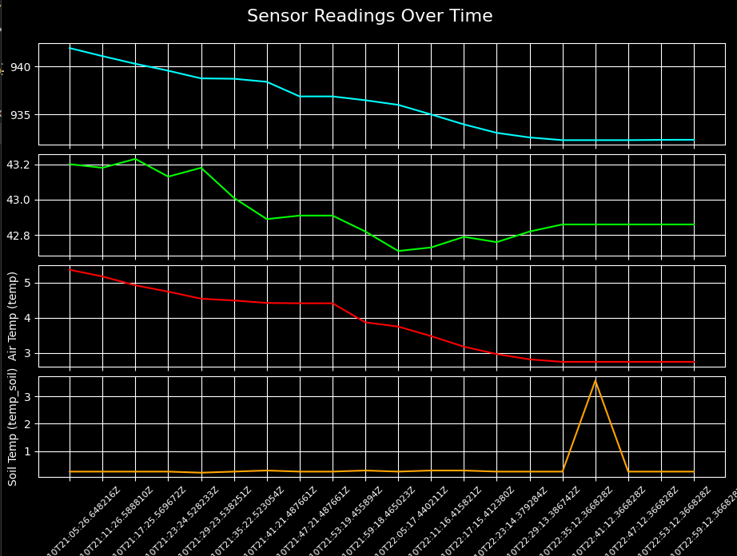

# IoT Data Sync Tool

A Python-based tool for processing, synchronizing, and visualizing IoT sensor data from:

- **InfluxDB Excel Export** (`InfluxDB_2024.xlsx`)
- **SIM Card Excel Export** (`Simcard_2024.xlsx`)

This tool identifies missing 6-minute intervals in sensor readings, inserts synthetic entries, and patches missing sensor values using SIM card data. Optionally, it can generate visual plots of the cleaned dataset.

---

## 📦 Features

- Convert Excel files to CSV
- Print CSV headers and data counts
- Detect missing 6-minute intervals
- Insert synthetic rows for missing time periods
- Patch missing sensor readings from SIM card
- Output cleaned data to `update.csv`
- Generate separate plots for each sensor parameter (`p`, `rh`, `temp`, `temp_soil`)
- ISO 8601 UTC timestamp format (`2024-02-10T21:05:26.648216Z`)
- Optional dark-themed visual graphs


## 📊 Example Plot

It will display **4 subplots**:

1. Pressure (`p`)
2. Humidity (`rh`)
3. Air Temperature (`temp`)
4. Soil Temperature (`temp_soil`)

With X-axis showing ISO-format time like:

## 📥 Requirements
- Install required Python packages using pip:
```bash
pip install pandas matplotlib openpyxl
```

## 🧠 How It Works
Excel → CSV: Converts InfluxDB_2024.xlsx and Simcard_2024.xlsx to CSV.

Header & Count: Prints header info and row counts.

Gap Detection: Finds and fills gaps in 6-minute intervals.

Patching: Fills missing sensor values (0 or 0.0) using SIM card data.

Output: Final dataset is written to update.csv.

Visualization: Optional graphing with black background and time-formatted X-axis.

## Real-Time Data & Dashboard Visualization (e.g., Grafana)
In real-world IoT deployments, this script is especially useful for detecting and handling data loss or transmission gaps in time series data.


👨‍💻 Author
Vinay N
Version: v1.0.0
Date: June 2025
